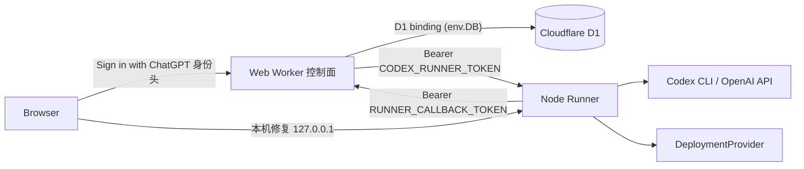
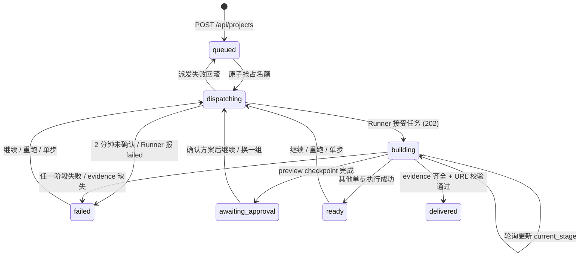

# API 与事件协议

## 1. 协议原则

- 浏览器只提交需求和启动任务，不能写入 `delivered` 或部署 URL。
- Runner API 只接受 Bearer token，状态读取也必须鉴权。
- `projectId` 同时是控制站项目和 Runner job 的幂等键。
- 当前用服务端轮询同步；未来 SSE/WebSocket 仍复用相同 job 字段。
- 错误文本可展示，但不得包含 Secret、完整系统路径或未经裁剪的模型输入。

## 2. 服务连接

控制面与执行面分离，服务之间通过 HTTPS + 凭证连接。Runner 自动维护公网入口；入口失效时，登录用户可从运行 Runner 的本机恢复接口取得新地址，再由控制面完成身份与健康检查后写入 D1：



| 连接 | 方式 | 说明 |
|---|---|---|
| 浏览器 → 控制面 | Sites 托管的 Sign in with ChatGPT；调度层注入稳定用户 ID 与邮箱 | 15 秒轮询 `GET /api/projects` 获取当前用户的进度 |
| 控制面 → D1 | Worker binding | `env.DB` 直连，不走网络 |
| 控制面 → Runner | D1 最新登记地址（`CODEX_RUNNER_URL` 为回退）+ `CODEX_RUNNER_TOKEN` | 派发、暂停、拉取状态与读取阶段产物 |
| Runner → 控制面 | `RUNNER_CALLBACK_TOKEN` | 交付结果回调；外层策略阻断时由控制面主动拉取终态 |
| 浏览器 → 本机 Runner | 严格 Origin + Private Network CORS | 用户点击“修复连接”时请求本机 Runner 轮换入口 |

`CODEX_RUNNER_TOKEN` 或 `RUNNER_CALLBACK_TOKEN` 缺失时派发路由直接返回 `503 EXECUTOR_OFFLINE`，不会伪造任务。Runner 地址优先来自 D1 最近一次经验证的登记；没有登记时才使用 `CODEX_RUNNER_URL`。Runner token 永不下发给浏览器。

## 3. 控制站 API（当前实现）

| 方法 | 路径 | 作用 |
|---|---|---|
| `GET` | `/signin-with-chatgpt` | Sites 调度层发起 ChatGPT 登录；应用不实现该保留路径 |
| `GET` | `/signout-with-chatgpt` | Sites 调度层退出并返回站内相对路径 |
| `POST` | `/api/auth/login` | 旧本地登录已停用，返回 410 与 ChatGPT 登录入口 |
| `GET` | `/api/auth/session` | 读取调度层提供的 ChatGPT 用户身份；未登录返回 401 |
| `GET` | `/api/projects` | 查询项目，并为执行中项目同步 Runner 状态 |
| `POST` | `/api/projects` | 保存完整需求，创建 `queued` 项目 |
| `DELETE` | `/api/projects/{projectId}` | 删除当前用户的非进行中历史项目 |
| `PATCH` | `/api/projects` | 始终返回 `403`，禁止浏览器伪造终态 |
| `POST` | `/api/v1/projects/{projectId}/jobs` | 服务端派发受信任 Runner |
| `POST` | `/api/v1/projects/{projectId}/pause` | 校验项目所有权并要求 Runner 真实暂停 |
| `GET` | `/api/v1/projects/{projectId}/artifacts/{stage}` | 校验所有权后读取指定步骤产物 |
| `POST` | `/api/v1/projects/{projectId}/preview-approval` | 向 Runner 复核当前 SVG 方案 ID，持久化确认结果 |
| `POST` | `/api/v1/projects/{projectId}/delivery` | 兼容 Runner 回调，需要 callback token |
| `GET` | `/api/v1/projects/{projectId}/delivery` | 受信任 Runner 或 Sites owner 读取项目需求 |
| `GET` | `/api/v1/runner/recover` | 已登录用户查询 Runner 连接状态 |
| `POST` | `/api/v1/runner/recover` | 校验本机 Runner 返回的新地址与实例编号后更新 D1 |
| `POST` | `/api/v1/runner/register` | 使用 callback token 鉴权，公网复核 Runner 实例与健康状态后自动更新 D1 |

### `GET /api/projects` 项目结构

```json
{
  "id": "prj_...",
  "name": "创建一个咖啡馆官网",
  "prompt": "创建一个咖啡馆官网……",
  "status": "building",
  "currentStage": "mobile-spec",
  "previewUrl": null,
  "updatedAt": "2026-08-14T00:00:00Z",
  "executionProgress": 36,
  "executionMessage": "正在生成 Design 并执行设计评审",
  "executionEvents": [
    { "id": "...", "at": "2026-08-14T00:00:00Z", "stage": "mobile-spec", "kind": "progress", "progress": 4, "message": "任务已进入执行队列" }
  ],
  "executionCheckpoints": ["mobile-spec", "preview"],
  "previewApprovalStatus": "pending",
  "selectedPreviewId": null
}
```

`executionProgress`、`executionMessage`、`executionEvents`、`executionCheckpoints` 当前由控制站查询 Runner 后临时附加，不写入 projects 表。响应还包含 `executionCapacity: { active, max: 2 }`。项目状态、最后阶段与 URL 写入 D1。

当用户已有 2 个 `dispatching/building` 项目时，`POST /api/projects` 和 jobs 派发返回 `409 EXECUTION_LIMIT_REACHED`。jobs 路由使用单条条件 UPDATE 原子占用名额，防止并发请求绕过计数。

`DELETE /api/projects/{projectId}` 只删除当前用户拥有的记录，并同时清理审批行；`dispatching/building` 项目返回 409。`awaiting_approval/ready/paused` 不占执行名额。

### 确认预览

`POST /api/v1/projects/{projectId}/preview-approval` 接受 `{ "previewId": "..." }`。路由校验登录用户和项目所有权，再使用 Runner Bearer token 读取当前 `preview` artifacts；只有 ID 属于当前 preview set 且 `format === "svg"` 时，才以 D1 batch 写入 `approved + previewSetId + selectedPreviewId` 并把项目置为 `ready/preview`。过期 ID 返回 409。浏览器随后重新派发 `continue`，但 Runner 仍会再次校验该 ID，形成控制面和执行面的双重门禁。

## 4. Runner API（当前实现）

### 健康检查

`GET /health`

```json
{ "ok": true, "deploymentProviderConfigured": true }
```

控制站在占用执行名额前先请求该接口，10 秒内不可达、返回非 JSON、`ok` 为 false 或未配置 DeploymentProvider 时直接返回 503，项目保持原状态。这样失效的 Runner 地址不会把项目卡在 `dispatching`。

页面收到 `EXECUTOR_OFFLINE`、`EXECUTOR_CONFIG_INVALID`、`EXECUTOR_UNHEALTHY` 或 `EXECUTOR_UNREACHABLE` 后展示“修复连接”。点击后浏览器只访问本机 `127.0.0.1:5174/control-endpoint/rotate`，Runner 关闭旧控制隧道并返回新地址与进程实例编号。控制面随后从公网检查该地址的 `/health`，只有实例编号一致、Runner 与部署能力均健康时才更新 D1，并自动按原执行模式重新派发任务。该方案不依赖 Runner 主动请求可能被外层策略阻断的控制站地址。

### 创建任务

`POST /jobs`

Headers：

```text
Authorization: Bearer <CODEX_RUNNER_TOKEN>
Idempotency-Key: project-<projectId>
Content-Type: application/json
```

Body：

```json
{
  "projectId": "prj_...",
  "requirement": "完整原始需求",
  "instructions": "服务端执行约束",
  "callbackUrl": "https://control.example/api/v1/projects/prj_.../delivery",
  "mode": "continue",
  "targetStage": null,
  "previousDeliveryUrl": "https://generated.example",
  "approvedPreviewId": "set_..._p2",
  "regeneratePreview": false
}
```

`mode` 可为 `continue | rerun | step`。阶段为 `mobile-spec | preview | implementation | build | deployment`。首次 `continue` 在生成 preview checkpoint 后返回 `awaiting_approval`；`rerun` 清除旧工作区并同样停在新的预览门禁；`step preview` 可带 `regeneratePreview: true`，只生成新 preview set，不调用 Codex 或构建。进入 implementation/build/deployment 前，Runner 必须验证 `approvedPreviewId` 属于当前需求的当前 preview set。控制面的定时拉取覆盖 `queued/dispatching/building/ready/awaiting_approval/paused/failed`。

兼容升级前工作区：若需求文件内容一致、五份规格文档完整、manifest 存在，并且 `.next/BUILD_ID` 与 Next 可执行文件存在，Runner 会一次性写入新 marker，把现有成功结果作为 Mobile Spec、implementation、build 检查点复用。

控制站只在收到 JSON 响应且 `job.id` 存在时把项目更新为 `building`。Runner 拒绝请求、返回非 JSON 或缺少任务编号时释放本次派发占位，并返回可诊断的错误码与 HTTP 状态。

### 查询任务

`GET /jobs/{projectId}`

```json
{
  "job": {
    "id": "job_...",
    "status": "awaiting_approval",
    "stage": "preview",
    "progress": 56,
    "message": "3 份预览已就绪；请选择一份并确认",
    "checkpoints": ["mobile-spec", "preview"],
    "events": [
      { "id": "...", "at": "2026-08-14T00:00:00Z", "message": "Runner 已接收任务" }
    ],
    "updatedAt": "2026-08-14T00:00:00Z"
  }
}
```

终态成功还包含：

```json
{
  "status": "delivered",
  "stage": "delivered",
  "progress": 100,
  "url": "https://generated.example",
  "evidence": {
    "mobileSpecPassed": true,
    "buildPassed": true,
    "deployPassed": true
  }
}
```

等待确认包含 `status: "awaiting_approval"`，Runner 同时以 `approval_required` 回调控制面并释放执行名额。失败包含 `status: "failed"`、`stage: "failed"` 和裁剪后的 `error`。

新完成或复用的非部署单步包含 `status: "checkpointed"`、指定 `stage` 和已完成的 `checkpoints`，控制面将项目写为 `ready`，不生成新交付 URL。如果已有完整 deployment 检查点、三项证据和外部 URL，则返回原 `delivered`，不重新部署也不丢失 URL。

若 Codex 返回重复 `navRoutes.href`，Runner 在 Manifest 规范化阶段保留第一项并去重；仍有至少 4 个不同路由时继续构建，不足 4 个或存在其他结构错误时把诊断作为下一次生成输入，单个 job 最多尝试三次。失败诊断按需求哈希持久化，下一次继续在原累计尝试次数后续修。manifest 同时记录 `generatedFiles`；修复写入前删除旧清单中已移除的文件，避免遗留 `app/.../page.tsx` 再次形成重复路由。

Mobile Spec 使用独立子阶段 marker 保存 propose/design/task 的连续成功前缀、累计尝试次数和最近生成或 gate 错误。失败后再次执行规格时，Runner 先复用完整的上游 Markdown 产物，再只调用当前失败子阶段。

### 暂停任务

`POST /jobs/{projectId}/pause`

需要 Runner Bearer token。只有 `queued/running` job 可暂停；Runner 立即把 job 标记为 `paused`，同时通过 `AbortController` 中断当前 Mobile Spec、Codex/OpenAI 调用、依赖安装、生产构建、临时部署或健康检查，并回调控制面写入 `paused`。重复暂停幂等返回 `202`；不存在或已进入其他终态时返回 `404/409`。

### 读取步骤产物

`POST /jobs/{projectId}/artifacts/{stage}` 仅接受 Runner Bearer token，并由控制面在 body 中传入项目原始需求做哈希校验。`mobile-spec` 返回五份 Markdown；`preview` 返回 3 份带 `id/setId/title/description` 的 `format: svg` 文件；`implementation` 返回生成清单；`build` 返回真实构建日志；`deployment` 返回 URL 与健康检查证据。

## 5. 进度与 message 映射

| 内部事件 | 对外阶段 | 进度 | message 含义 |
|---|---|---:|---|
| queued | mobile-spec | 4 | 已进入队列 |
| spec-workflow | mobile-spec | 9 | 初始化规格工作区 |
| spec-propose | mobile-spec | 18 | Proposal 与 Specs |
| spec-design | mobile-spec | 36 | Design 与 Review |
| spec-task | mobile-spec | 52 | Tasks 与 gate |
| preview | preview | 56 | 生成 3 份 SVG 并等待确认 |
| llm | implementation | 64 | Codex 生成页面 |
| write | implementation | 72 | 写入项目文件 |
| retry | implementation | 76 | 根据构建日志修复 |
| build | build | 80 | 安装依赖和生产构建 |
| done | build | 88 | 构建完成 |
| checkpointed | 指定步骤 | 88 | 单步成功或复用，产物已保存 |
| deployment | deployment | 92 | 发布与健康检查 |
| delivered | delivered | 100 | 三项 evidence 通过 |
| failed | failed | 100 | 失败且无交付 URL |

进度代表阶段性里程碑，不是模型 token 或墙钟时间的线性百分比。

## 6. 数据模型与处理

### 存储分工

| 存储位置 | 数据内容 | 角色 |
|---|---|---|
| Cloudflare D1 | users / projects / project_preview_approvals；sessions 仅兼容保留 | 项目终态与预览审批来源 |
| Runner 内存 | job / progress / message / events / evidence | **执行中**状态来源，重启即丢失 |
| Runner 工作区 | requirement-scoped checkpoints / Markdown / manifest / build log / deployment evidence | 成功阶段复用与产物查看 |

Schema 双份维护：Drizzle 定义在 `apps/web/db/schema.ts`（迁移文件在 `drizzle/`），运行时幂等建表在 `apps/web/app/lib/server-auth.ts` 的 `ensureDatabase()`，两处需人工保持一致。

### 表结构

**users**：`id`（`usr_` 前缀；由站点内稳定 ChatGPT 用户 ID 的 SHA-256 前缀派生）、`username`（ChatGPT 显示名或邮箱）、`username_normalized`（归一化邮箱，唯一索引）、`status`。密码字段只为兼容旧表结构保留，当前认证不读取。

**sessions**：旧本地会话兼容表，当前请求鉴权不再读取。

**projects**：`id`（`prj_` + UUID）、`owner_user_id`、`name`、`prompt`、`status`、`current_stage`、`preview_url`（仅 delivered 时写入）、时间戳。

**project_preview_approvals**：以 `project_id` 为主键，保存 `owner_user_id`、`pending|approved`、`preview_set_id`、`selected_preview_id`、`approved_at`。预览图片本体仍在 Runner 工作区，D1 只保存审批事实和集合身份。

### 核心数据流

1. **提交**：校验 ChatGPT 身份与输入长度 → 容量检查（全站共享 Runner < 2 个进行中）→ INSERT `queued` 记录，不触发执行。
2. **派发**：原子抢占名额（单条条件 UPDATE，靠 `meta.changes` 判断成败）置 `dispatching` → 带 `Idempotency-Key` POST 给 Runner → 返回 202 置 `building`；派发失败回滚原状态；响应未知则保持 `dispatching` 占位交给轮询收敛。
3. **同步**：`GET /api/projects` 对执行中项目并发拉取 Runner，按返回状态更新 D1（见下表）；progress / message / events 只透传不落库（message 截断 600 字符、events 取末 12 条）；Runner 读失败静默忽略，**绝不发明终态**；`dispatching` 超 2 分钟未确认批量置 failed 释放名额。
4. **回调**：Runner 带 token 回调 delivery 路由，timing-safe 比对通过且校验齐全才写终态，与轮询互为冗余的两条终态通道。

### 状态机



不变量：只有 Runner 回调（带 token）或控制面轮询到可信 Runner 终态两条路能写终态；浏览器侧 `PATCH /api/projects` 始终 403；delivered 必须同时具备 `mobileSpecPassed` / `buildPassed` / `deployPassed` 三项 evidence 且 URL 通过校验，任一缺失按 failed 处理。

### 数据校验汇总

| 数据 | 校验规则 |
|---|---|
| 浏览器身份 | 只信任 Sites 调度层注入的稳定 ChatGPT 用户 ID 与邮箱；匿名 API 请求返回 401 |
| 数据隔离 | 稳定身份派生 `owner_user_id`，所有项目查询、删除、暂停、执行和产物读取均校验所有权 |
| 项目输入 | name ≤ 100 / prompt ≤ 4000，空值拒绝 |
| 执行容量 | 共享 Runner 全站最多 2 个进行中项目，提交与派发两处全局检查 |
| Runner 消息 | message ≤ 600、events ≤ 12 条、stage ≤ 40、progress 夹在 0-100 |
| 交付 URL | 必须 HTTPS、非 localhost、非控制站自身、非 `/preview` 路径 |
| 回调身份 | `RUNNER_CALLBACK_TOKEN` timing-safe 比对 |

## 7. 未来协议

生产化后应增加 `jobId` 资源、attempt、cursor-based event stream、cancel、lease、checkpoint、artifact 和 deployment 资源。事件至少应包含 `sequence`、`occurredAt`、`attemptId`、`type`、`payload`，支持断线重放和幂等落库。

当前 Runner 内存事件不能满足重启恢复，不能被当作最终审计日志。
