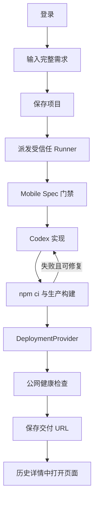

# MVP 产品说明

## 1. 产品定位

Mobile Build 是一个移动端网站生成入口。用户提交一句完整需求，受信任 Runner 将其转成 Mobile Spec，调用 Codex 实现 Next.js 页面，完成生产构建和部署检查，最后返回独立 HTTPS URL。

产品不允许浏览器用定时器、模板或记录页模拟执行；用户看到的进度必须来自 Runner 状态。

## 2. 当前用户流程

执行页展示六个阶段：需求、Mobile Spec、Codex、构建、部署、完成。执行中每 3 秒同步百分比、当前 message 和最近事件；历史项目可点击恢复同一详情视图。

## 3. 已实现范围

- 应用内 MVP 登录与项目 D1 持久化。
- 纯文本完整需求；链接可以作为需求文本的一部分。
- 无关键词模板、无固定业务页面、无健身示例项目。
- Mobile Spec：Proposal、Specs、Design、Review、Tasks 和 gate。
- Codex CLI / OpenAI API 二选一结构化 Provider。
- 中立 Next.js 模板、完整文件 manifest、安全路径校验。
- 可复现依赖安装、生产构建、失败日志修复。
- Runner 实时 progress/message/events 与历史项目详情。
- 外部 HTTPS URL 检查与三项交付 evidence。

## 4. 验收实现与生产边界

当前真实链路已经端到端成功，但仍属于受控验收环境：

- Runner 是本机常驻进程，公网入口依赖临时隧道；关闭进程后不可执行新任务。
- 生成页面由 Cloudflare Quick Tunnel 暴露，无稳定域名、持久性或 SLA。
- 执行中事件保存在 Runner 内存；Runner 重启后无法恢复正在执行的 job。
- D1 保留需求、项目终态和交付 URL，因此控制站刷新后仍可查看已保存历史。

因此，当前可称为“真实验收链路”，不可称为“生产级云端构建平台”。

## 5. 尚未实现

- 持久 job、attempt、event、checkpoint 和 artifact store。
- 取消、暂停、断点继续、Runner lease 与故障转移。
- 源码 ZIP、不可变 checkpoint 和继续修改。
- 正式 Cloud Runner 与持久 DeploymentProvider。
- 邀请制多用户、配额、计费、审计查询和数据删除。
- iOS、Android、Harmony 的真实生成与构建。

## 6. 状态与交付语义

当前项目状态：

`queued → building → delivered`

失败终态：`failed`。`currentStage` 使用：

`requirement | mobile-spec | implementation | build | deployment | delivered | failed`

只有以下条件同时成立才允许保存 `delivered`：

- Mobile Spec artifacts 与所有 gate 通过。
- `npm run build` 成功。
- DeploymentProvider 返回非 localhost、非控制站、非 `/preview` 的 HTTPS URL。
- 公网健康检查返回非 5xx。
- Runner 返回 `mobileSpecPassed`、`buildPassed`、`deployPassed` 三项证据。

## 7. 当前验收场景

至少覆盖：记账网站、活动报名页、团队看板和从未预设过的新业务网站。每条需求必须验证内容匹配、门禁、生产构建、外部 URL 和 HTTP 结果；失败用例必须确认没有交付 URL。

生产化验收还需增加 Runner 重启恢复、断网重连、并发幂等、部署 Provider 半成功、取消和 Secret 泄漏测试。
