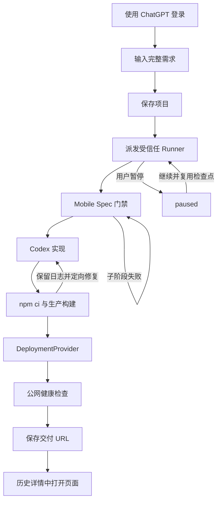

# MVP 产品说明

## 1. 产品定位

Mobile Build 是一个移动端网站生成入口。用户提交一句完整需求，受信任 Runner 将其转成 Mobile Spec，调用 Codex 实现 Next.js 页面，完成生产构建和部署检查，最后返回独立 HTTPS URL。

产品不允许浏览器用定时器、模板或记录页模拟执行；用户看到的进度必须来自 Runner 状态。

## 2. 当前用户流程

执行页展示六个阶段：需求、Mobile Spec、Codex、构建、部署、完成。执行中每 15 秒同步百分比、当前 message 和最近事件，包含 Codex 生成、文件校验写入、构建修复，以及公网健康检查每次探测的 HTTP 或网络结果。运行中可真实暂停；“继续”复用成功检查点并从失败位置续修，“重跑”才清除检查点。输入框上方可单独执行规格、实现、构建或部署；已成功单步直接复用，失败单步不从该步骤开头重做。阶段卡片可打开独立产物面板，`.md` 文件按 Markdown 渲染。历史项目可点击恢复同一详情视图，非进行中记录允许删除。

## 3. 已实现范围

- ChatGPT 登录与项目 D1 持久化；ChatGPT 稳定用户 ID 只用于身份映射和数据隔离，Codex、Runner、构建和部署继续使用平台统一配置。
- 纯文本完整需求；链接可以作为需求文本的一部分。
- 完整需求直接进入生成流程，不依赖关键词模板或固定业务页面。
- Mobile Spec：Proposal、Specs、Design、Review、Tasks 和 gate。
- Codex CLI / OpenAI API 二选一结构化 Provider。
- 中立 Next.js 模板、完整文件 manifest、安全路径校验。
- 可复现依赖安装、生产构建、失败日志修复。
- Runner 实时 progress/message/events 与历史项目详情。
- 平台共享 Runner 全站最多同时执行 2 个需求；服务端原子占位并拒绝第三个任务。
- Runner 协作式暂停、子进程终止、检查点继续与显式完整重跑；暂停任务立即释放执行名额。
- 四个执行阶段支持单步运行与前置检查；规格文档、实现清单、构建日志和部署证据可独立查看。
- Mobile Spec 保存 propose/design/task 子阶段进度；Codex 与构建保存最近错误，下一次只修复当前失败位置。
- 外部 HTTPS URL 检查与三项交付 evidence。

## 4. 验收实现与生产边界

当前真实链路已经端到端成功，但仍属于受控验收环境：

- Runner 是本机常驻进程，公网入口依赖临时隧道；关闭进程后不可执行新任务。
- 生成页面由 Cloudflare Quick Tunnel 暴露，无稳定域名、持久性或 SLA。
- 执行中事件保存在 Runner 内存；成功检查点与产物保存在 Runner 本地工作区。Runner 重启后无法恢复正在执行的 job，但可从已成功阶段继续。
- D1 保留需求、项目终态和交付 URL，因此控制站刷新后仍可查看已保存历史。

因此，当前可称为“真实验收链路”，不可称为“生产级云端构建平台”。

## 5. 尚未实现

- 持久 job、attempt、event 和共享 artifact store。
- 取消、Runner lease、跨 Runner 故障转移与执行中自动恢复。
- 源码 ZIP、不可变远端 checkpoint 和继续修改。
- 正式 Cloud Runner 与持久 DeploymentProvider。
- 用户级预算、计费、审计查询和数据删除。
- iOS、Android、Harmony 的真实生成与构建。

## 6. 状态与交付语义

当前项目状态：

`queued → dispatching → building → ready | delivered`

可继续或重跑的状态：`ready`、`paused`、`failed`、`delivered`。`ready` 表示指定单步执行成功并已保存检查点。`currentStage` 使用：

`requirement | mobile-spec | implementation | build | deployment | paused | delivered | failed`

`dispatching` 是控制站已原子占用并发名额、正在等待 Runner 接受任务的短暂状态；Runner 确认后进入 `building`，明确拒绝时回到原状态，响应未知超过 2 分钟则失败并释放名额。

只有以下条件同时成立才允许保存 `delivered`：

- Mobile Spec artifacts 与所有 gate 通过。
- `npm run build` 成功。
- DeploymentProvider 返回非 localhost、非控制站、非 `/preview` 的 HTTPS URL。
- 公网健康检查返回非 5xx。
- 临时隧道必须完成连接注册；健康检查在总时限内重试 DNS、连接与 5xx，并在最终失败时回收预览和隧道进程。
- 同一项目继续执行时按原始需求哈希校验 Mobile Spec、实现和构建 checkpoint，并从首个未完成阶段继续。
- Mobile Spec 子阶段通过后不再生成；实现/构建失败将最近结构错误、写入错误或构建日志作为下一次 Codex 修复输入。
- 单步目标已有成功检查点时直接返回复用结果；项目已有完整交付证据时同时保留现有交付 URL。
- 升级前已存在且文件完整的规格、manifest 和生产构建会自动迁移为新检查点，首次继续不会重复构建。
- 用户主动“重跑”不会复用检查点，而是清除旧工作区并从 Mobile Spec 开始新 job。
- Runner 返回 `mobileSpecPassed`、`buildPassed`、`deployPassed` 三项证据。

## 7. 当前验收场景

至少覆盖：记账网站、活动报名页、团队看板和从未预设过的新业务网站。每条需求必须验证内容匹配、门禁、生产构建、外部 URL 和 HTTP 结果；失败用例必须确认没有交付 URL。

生产化验收还需增加 Runner 重启恢复、断网重连、并发幂等、部署 Provider 半成功、取消、暂停竞态和 Secret 泄漏测试。
