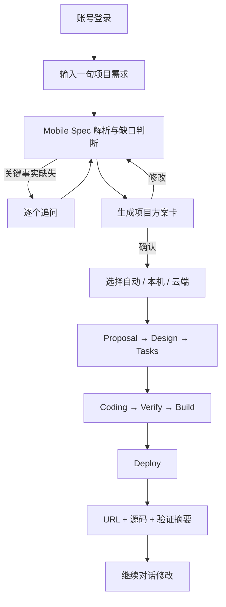

# MVP 产品说明

## 1. 产品定位

Mobile Build 是一个手机端 AI 项目构建入口。用户用一句话描述想做的网站，系统先生成可确认的项目方案，再选择用户电脑或云端执行器完成 Next.js 项目的初始化、实现、验证、构建和部署，最终返回可访问 URL 与源代码产物。

产品不是“把一段 Prompt 直接交给 Shell”，而是由 Mobile Spec 把自然语言转成可追踪规格、任务、门禁和交付记录，再由受控执行器实施。

## 2. 目标用户和核心场景

### 目标用户

- 希望随时用手机创建原型、活动页、工具站或内部应用的产品与开发人员。
- 希望远程驱动自己电脑上现有项目和开发环境的个人用户。
- 电脑离线时，希望使用标准云端环境继续构建新项目的用户。

### 核心场景

1. 在手机中登录并输入一句需求。
2. 查看系统整理的页面、功能、数据、技术栈、执行位置和排除项。
3. 确认方案，观察 Mobile Spec、编码、验证、构建和部署进度。
4. 打开交付 URL，继续对话修改项目，或下载指定 checkpoint 的源码。

## 3. 用户主流程

## 4. 首个真实 MVP 范围

这里的“真实 MVP”指下一阶段需要打通的最小闭环，不等同于当前已上线的交互演示。

### 必须完成

- 账号登录、项目与会话列表。
- 新建 Next.js 项目，不处理已有仓库。
- Cloud Agent 单一真实执行路径（Desktop Agent 入口已移除，暂不纳入当前范围）。
- Mobile Spec Web 工作流：Proposal、Specs、Design、Review、Tasks、Coding、Verify、Archive。
- 真实文件变更、结构化命令、日志和阶段事件流。
- `npm run lint`、类型检查、测试、生产构建和最小健康检查。
- 一个真实 `DeploymentProvider`，成功后返回 HTTPS Preview URL。
- 指定 checkpoint 源码 ZIP 下载。
- 暂停、取消、失败重试和继续修改。

### 暂不纳入首个真实 MVP

- GitHub/GitLab 登录、SSO 和自动创建远程仓库。
- 多人协作、团队权限、计费与套餐。
- Production 发布和自动创建付费外部资源。
- iOS、Android、Harmony 项目真实云端构建。
- 运行中在本机与云端之间无缝迁移。
- 任意用户自定义 Shell 或无限网络访问。

## 5. 当前上线版本的真实边界

当前版本用于验证移动端需求入口，不能作为真实 AI 构建能力对外宣传：

- 登录、会话 Cookie、D1 项目记录是真实实现。
- 原始需求、账户会话和项目草稿是真实实现；文本可与链接同时保存。
- 浏览器端关键词规则、预设页面模板、示例构建日志和内置 `/preview` 已移除。
- 本机 Desktop Agent 执行入口及其协议代码包已移除，真实执行统一走 Cloud Agent。
- 云端执行器、持久化任务状态机、SSE、真实验证证据和 DeploymentProvider 仍待接入。
- 真实 MVP 的唯一链路是“需求 → Mobile Spec artifacts → Agent 独立实现 → 发布 → 独立 URL”，包括从未预设过的需求。

## 6. 产品状态与交付语义

项目状态建议统一为：

`draft → planning → awaiting_approval → queued → running → verifying → deploying → ready`

终止状态：`failed`、`cancelled`、`blocked`、`archived`。

只有同时满足以下条件才能显示“已交付”：

- Mobile Spec 必需 artifacts 完整，所有 gate 通过。
- 源代码存在不可变 checkpoint。
- 验证与生产构建成功。
- 部署平台返回稳定 deployment ID 和 HTTPS URL。
- 对 URL 完成最小健康检查。

## 7. 非功能目标

- 手机端首次可交互目标：P75 小于 2.5 秒。
- 创建任务接口目标：P95 小于 500 毫秒，不包含模型执行时间。
- 事件展示延迟目标：P95 小于 2 秒。
- 每次执行均可取消、可审计、可从最近 checkpoint 重试。
- 任意失败都不能丢失最近已确认方案和最近有效源码快照。
- 平台和 Cloud Agent 不能在日志中输出明文 Secret。

## 8. MVP 验收场景

至少使用以下四个固定需求做端到端回归，其中第 4 项必须用于证明系统没有依赖预设模板：

1. “做一个极简个人记账网站，可按月份查看支出。”
2. “做一个活动报名页，带人数统计和移动端分享。”
3. “做一个团队待办看板，支持优先级和筛选。”
4. “做一个生活方式电商网站，支持商品浏览和购物车。”

每个场景必须从一句话完成方案确认、代码生成、验证、构建、部署、URL 健康检查和 ZIP 下载；失败注入测试至少覆盖依赖安装失败、测试失败、部署失败、用户取消和事件流重连。
