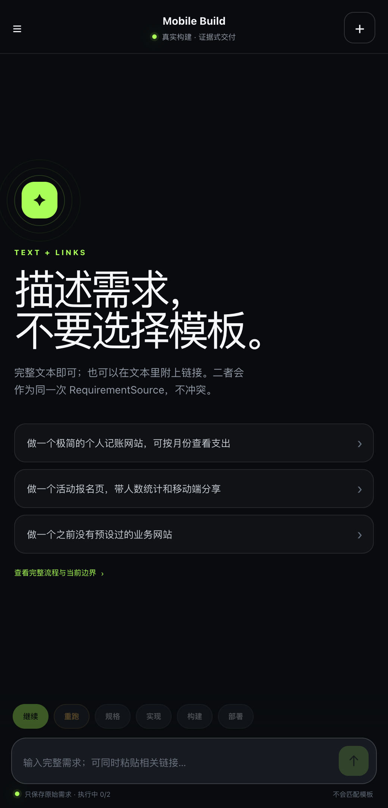
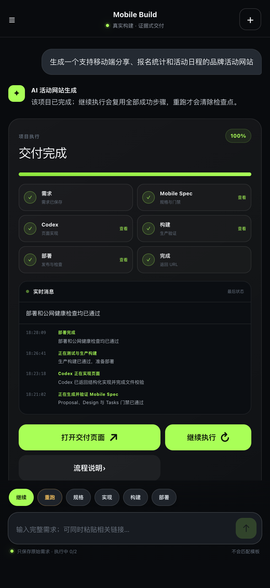
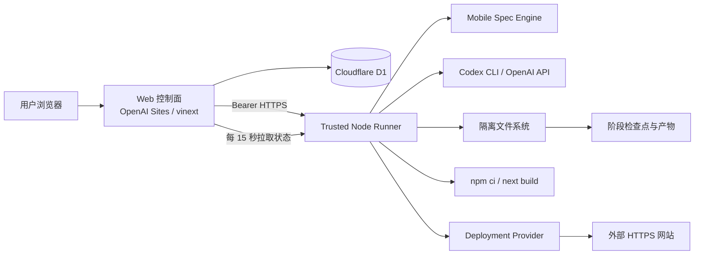
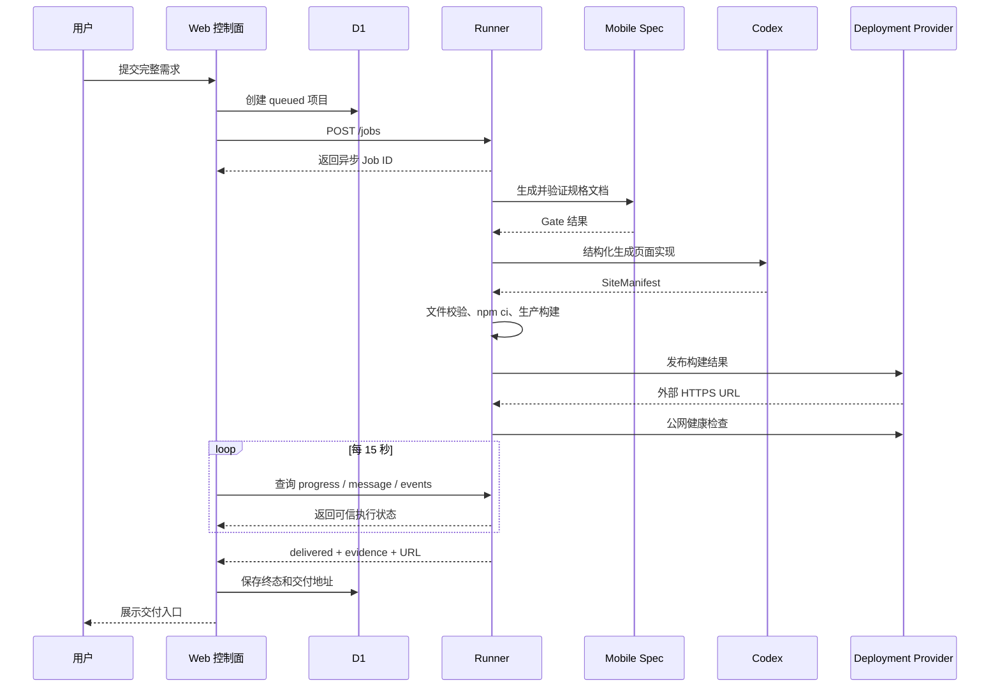

# SiteForge AI 智能网站生成与交付平台

> 项目介绍文档｜当前产品界面代号：Mobile Build  
> 项目角色：项目经理 / 全栈开发负责人

## 1. 一句话介绍

SiteForge AI 是一套面向非技术用户的智能网站生成与交付平台。用户输入一句自然语言需求后，系统会完成需求结构化、页面规格设计、AI 代码生成、生产构建、公网部署与健康检查，最终返回一个可以直接访问的网站 URL。

这个项目解决的不是“让 AI 输出一段页面代码”，而是“如何把一句模糊需求稳定地转换成经过验证、能够真实访问的交付结果”。

## 2. 产品介绍

### 2.1 产品背景

传统网站原型或 MVP 的交付通常需要经过产品沟通、页面设计、前端开发、依赖安装、构建和部署等多个环节。对于不具备开发能力的用户来说，即使已经能通过大模型生成代码，也仍然需要自己处理以下问题：

- 不知道如何把业务想法整理成可执行的页面规格；
- AI 输出的代码可能缺少文件、路由重复或无法构建；
- 执行过程不可见，不知道系统是真的在运行还是只展示了模拟进度；
- 某一步失败后只能全部重来，模型调用和构建成本较高；
- 最终拿到的是代码或站内预览，而不是可以直接访问的独立网站。

SiteForge AI 将这些环节封装成一条可观察、可暂停、可恢复并且具有交付证据的自动化流水线。

### 2.2 目标用户

- 希望快速验证产品想法的产品经理和创业者；
- 需要快速制作活动页、展示页或内部工具的运营人员；
- 希望减少重复页面开发工作的研发团队；
- 需要从业务需求直接获得可访问原型的非技术用户。

### 2.3 核心用户流程


用户不需要选择行业模板，也不需要理解代码和部署环境。平台保存完整需求文本，并将真实执行状态持续同步到控制台。

### 2.4 产品界面

#### 需求输入与产品入口



产品入口强调“描述需求，不要选择模板”。用户可以输入完整文本，也可以附带公开链接，系统不会使用关键词把需求替换成固定业务页面。

#### 执行进度与证据式交付



执行详情展示需求、Mobile Spec、Codex、构建、部署和完成六个阶段。用户可以查看实时消息、阶段产物、最终交付入口，也可以继续、重跑或单独执行某一个步骤。

> 配图使用真实产品前端与脱敏演示数据生成，不包含用户账号、密钥或真实业务数据。

### 2.5 已实现的核心能力

1. **一句话生成网站**：保存用户的完整需求，不进行关键词分类或固定模板匹配。
2. **Mobile Spec 规格工作流**：生成 Proposal、Specs、Design、Review 和 Tasks，并通过确定性门禁。
3. **AI 结构化实现**：支持 Codex CLI 或 OpenAI Structured Outputs，输出符合约束的 SiteManifest。
4. **真实生产构建**：执行锁定依赖安装和 `next build`，构建失败时将真实日志反馈给 Codex 定向修复。
5. **实时执行进度**：每 15 秒同步 Runner 的进度、当前消息和最近事件，而不是由前端计时器模拟。
6. **暂停与恢复**：可以中断 Mobile Spec、模型调用、依赖安装、构建或健康检查，并从成功检查点继续。
7. **单步骤执行**：规格、实现、构建和部署可以独立执行和查看产物。
8. **历史项目管理**：支持历史详情、项目删除、Markdown 规格文档和构建日志预览。
9. **并发控制**：单用户最多同时执行 2 个任务，由服务端原子占位。
10. **证据式交付**：只有规格、构建和部署三项证据全部通过，系统才会保存交付 URL。

## 3. 技术方案

### 3.1 技术栈

| 层级 | 技术 | 主要职责 |
|---|---|---|
| Web 控制面 | Next.js、React、TypeScript、vinext | 登录、需求输入、历史记录、进度与产物展示 |
| 托管与数据 | OpenAI Sites、Cloudflare Workers、D1 | 控制站部署、会话与项目终态持久化 |
| 执行面 | Node.js Trusted Runner | 调用模型、写文件、运行子进程、构建与部署 |
| AI Provider | Codex CLI / OpenAI API | 生成结构化页面实现与失败修复 |
| 规格引擎 | 自研 Mobile Spec | Proposal、Specs、Design、Review、Tasks 与门禁 |
| 页面工程 | Next.js 中立模板 | 承载需求特定的页面与路由实现 |
| 部署验收 | Cloudflare Quick Tunnel、curl | 提供外部 HTTPS URL 与公网健康检查 |
| 质量保障 | Node Test、ESLint、生产构建、文档检查 | 契约测试、构建验证和文档同步 |

### 3.2 为什么拆分控制面和执行面

Web 控制站运行在 Cloudflare Worker 环境，适合处理 HTTP 请求和持久化数据，但不能安全地执行 Shell、安装依赖或操作隔离文件系统。因此项目采用控制面与执行面分离的架构：

- **控制面**负责用户身份、项目数据、任务派发、状态同步和结果展示；
- **执行面**负责 Mobile Spec、模型调用、文件写入、依赖安装、构建和部署；
- 两者通过带 Bearer Token 的 HTTPS API 通信；
- 浏览器不接触 Runner Token，也不能直接修改项目终态或注入交付 URL。

这种设计使 AI 生成和构建行为始终发生在受信任环境中，同时保留了 Web 产品轻量、易部署的特点。

## 4. 架构设计

### 4.1 当前系统架构



### 4.2 任务执行时序



### 4.3 状态与数据设计

系统将 D1 和 Runner 的职责分开：

- D1 保存需求、项目状态、当前阶段和最终交付 URL；
- Runner 内存保存执行中的 Job、进度、消息和最近事件；
- Runner 工作区保存需求哈希绑定的检查点、规格文档、生成清单、构建日志和部署证据；
- 控制站主动拉取 Runner 状态，并在获得可信终态后更新 D1；
- 已交付记录不依赖 Runner 内存继续存在。

主要状态流转为：

```text
queued → dispatching → building → ready | paused | failed | delivered
```

其中 `ready` 表示某个单独步骤已经成功并保存产物；`delivered` 表示完整流程及交付证据均已通过。

### 4.4 检查点设计

检查点按照需求哈希隔离，避免复用其他需求的结果：

- Mobile Spec 保存 propose、design、task 等子阶段进度；
- implementation 保存结构化生成清单与文件账本；
- build 保存生产构建标记和真实日志；
- deployment 保存外部 URL、健康检查时间和交付证据。

`continue` 从第一个未完成或失败的位置继续，`step` 只运行指定步骤，只有 `rerun` 会清空检查点并从头执行。

## 5. 关键困难与解决思路

### 5.1 如何证明任务是真执行，而不是前端模拟

**问题：** AI 产品很容易通过前端定时器展示“正在生成、正在构建”等假进度，但这些信息无法证明后端真的执行了任务。

**解决思路：**

- 所有进度、消息和事件都由 Runner 产生；
- 控制站每 15 秒通过服务端读取 Runner 状态；
- 浏览器不能直接把项目改成 `delivered`；
- 交付必须同时包含 `mobileSpecPassed`、`buildPassed`、`deployPassed` 三项证据；
- URL 必须为非 localhost、非控制站、非站内 `/preview` 的外部 HTTPS 地址。

**结果：** 产品从“生成演示”升级为可以验证每个阶段的真实交付链路。

### 5.2 长流程失败后如何避免全部重跑

**问题：** 规格、AI 生成、依赖安装和生产构建耗时较长。如果部署失败后重新执行全部流程，会增加等待时间和模型成本。

**解决思路：**

- 为规格、实现、构建和部署分别建立需求哈希检查点；
- 成功步骤直接复用，不再调用模型或重新构建；
- Mobile Spec 记录成功子阶段和最近 Gate 错误；
- 实现或构建失败时保存真实诊断，并作为下一次 Codex 修复输入；
- 只有用户明确点击“重跑”时才清理工作区。

**结果：** 部署问题只修复部署，构建问题只修复构建，显著减少无效重复执行。

### 5.3 如何控制 AI 输出的不确定性

**问题：** 模型可能生成重复路由、缺失页面、危险路径、外部字体依赖或不完整文件，直接写入文件系统会带来构建和安全风险。

**解决思路：**

- 使用 Structured Outputs 和 Zod/JSON Schema 约束 SiteManifest；
- 校验文件数量、扩展名、必需文件、导航路由和页面文件对应关系；
- 禁止绝对路径和路径穿越；
- 对重复导航进行确定性合并，合并后仍不足要求则把真实错误反馈给模型；
- 通过生成文件账本删除修复后不再需要的旧路由，避免遗留文件导致重复路由；
- 最多进行三轮带真实错误上下文的定向修复。

**结果：** 将开放式代码生成转换为“受 Schema 约束、可验证、可修复”的工程流水线。

### 5.4 临时部署域名无法解析

**问题：** Cloudflare Quick Tunnel 已返回域名并注册连接，但本机系统 DNS 仍可能持续返回 `Could not resolve host`，导致健康检查把已存在的域名误判为部署失败。

**解决思路：**

- 强制 Quick Tunnel 使用 HTTP/2，提高连接注册稳定性；
- 系统 DNS 失败时使用公共 DNS 查询域名；
- 使用解析结果固定 Cloudflare 边缘 IP，再验证原始 HTTPS URL；
- 单个地址持续失败时，在总时限内最多自动创建 3 个新地址；
- 更换部署地址时保留规格、实现和构建检查点。

**结果：** 实际问题中第一次系统 DNS 失败，第二次通过公共 DNS 回退获得 HTTP 200，任务成功进入 `delivered`。

### 5.5 控制站与 Runner 状态不一致

**问题：** 控制站外层访问策略可能阻止 Runner 主动回调，出现 Runner 已成功但 D1 仍显示失败的情况。

**解决思路：**

- 将主动回调作为加速路径，而不是唯一状态来源；
- 控制站通过鉴权接口主动查询 Runner；
- `queued`、`dispatching`、`building`、`ready`、`paused` 和 `failed` 均可被 Runner 最新可信状态校正；
- D1 已交付状态保持持久，不依赖 Runner 重启后的内存数据。

**结果：** 即使主动回调失败，页面刷新后仍能恢复正确的交付状态和 URL。

### 5.6 暂停和并发控制

**问题：** AI 调用、安装、构建和健康检查都可能占用较长时间，仅在 UI 中修改状态并不能真正停止资源消耗。

**解决思路：**

- Runner 为每个 Job 创建独立 `AbortController`；
- 中断信号传递到模型调用、Mobile Spec、npm、构建、隧道和健康检查子进程；
- 暂停完成后释放并发名额；
- 服务端通过原子更新限制单用户最多同时执行 2 个任务。

**结果：** 暂停是执行层真实停止，而不是界面上的状态切换。

## 6. 安全与可信设计

- 控制站与 Runner 使用独立 Bearer Token；
- Runner 产物接口不直接暴露给浏览器；
- 登录会话使用 HttpOnly、Secure、SameSite Cookie；
- 密码使用 PBKDF2-SHA256、独立 Salt 和迭代次数；
- Codex CLI 使用 ephemeral、read-only sandbox；
- 生成文件经过路径、扩展名和路由校验；
- 浏览器无权写入最终状态和交付 URL；
- Secret 只存在于受控环境变量，不进入日志、文档和 Git；
- 当前已建立 44 项 Runner 测试、12 项 Web 契约测试，并执行 ESLint、生产构建和文档检查。

## 7. 当前边界

当前系统已经打通可验证的真实交付链路，但距离完整的生产级云构建平台仍有以下边界：

- Runner 当前为常驻 Node 进程，不是弹性 Cloud Runner；
- 执行事件保存在 Runner 内存，进程重启后无法恢复正在运行的 Job；
- 成功检查点与产物保存在 Runner 本地工作区，尚未进入共享对象存储；
- Quick Tunnel 没有固定域名和 SLA，只适合开发与验收；
- 尚未实现正式计费、租户配额、取消、审计查询和跨 Runner 接管。

这些边界也明确了项目从当前可用版本走向规模化生产平台时需要补齐的能力。

## 8. 未来规划

### 8.1 执行平台云化

- 将本机 Runner 替换为托管的隔离 Runner Pool；
- 为任务增加 Queue、Lease、Heartbeat 和超时回收；
- 支持进程异常后的其他 Runner 接管；
- 为不同任务设置 CPU、内存、网络和执行时间配额。

### 8.2 状态与产物持久化

- 建立持久化的 Job、Attempt、Event 和 Checkpoint 数据模型；
- 事件增加 Sequence 和 Cursor，支持断线重放；
- 将规格、源码包、构建日志和部署证据保存到对象存储；
- 支持源码 ZIP 下载、版本对比和基于旧项目继续修改。

### 8.3 正式部署能力

- 接入 Vercel、Cloudflare Pages、OpenAI Sites 或自有部署平台；
- 引入持久 Deployment ID、幂等查询、回滚、删除和域名管理；
- 将临时 URL 替换为可长期访问的项目域名；
- 增加部署审批、灰度发布和多环境管理。

### 8.4 产品商业化

- 增加邀请制账户、团队空间和角色权限；
- 按模型 Token、构建时长和部署资源建立配额；
- 增加任务成本、成功率、平均交付时间和失败原因分析；
- 建立模板市场，但模板只作为可选加速能力，不替代用户原始需求；
- 引入自动评测，对需求覆盖率、页面质量、可访问性和性能进行评分。
