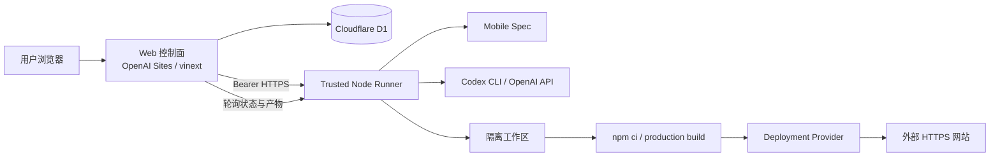

# 系统架构

## 1. 架构目标

系统需要让云端控制站保持轻量，同时在受信任环境中完成文件写入、模型调用、依赖安装和构建。因此采用控制面与执行面分离架构。

## 2. 组件职责

### Web 控制面

代码入口：`apps/web/`

- 使用 Sites 托管的 ChatGPT 登录识别用户；
- 在 D1 中保存用户、项目、预览审批、Runner Endpoint 和交付终态；
- 校验所有权、并发上限和状态迁移；
- 通过 Bearer HTTPS 派发、暂停和查询 Runner；
- 每 15 秒同步真实进度、message 和 events；
- 代理读取阶段产物，浏览器不直接接触 Runner Token。

控制面不执行 Shell，不安装 npm 依赖，也不直接读写 Runner 工作区。

### Trusted Runner

代码入口：`packages/codegen/runner.mjs` 与 `packages/codegen/src/`

- 按 `projectId` 幂等接收异步任务；
- 驱动 Mobile Spec、预览、实现、构建和部署；
- 调用 Codex CLI 或 OpenAI Structured Outputs；
- 校验 SiteManifest 和安全文件路径；
- 保存需求哈希绑定的检查点、产物和修复诊断；
- 维护运行中 job、progress、message、events 和 evidence；
- 维护 Runner 控制 Tunnel，并对部署 URL 做公网健康检查。

### Mobile Spec

代码入口：`packages/mobile-spec/`

Mobile Spec 负责把需求转换为 Proposal、Specs、Design、Review 和 Tasks，并运行确定性 Gate。Runner 通过 `packages/codegen/src/spec-workflow.js` 驱动该工作流。规格未通过时不能进入预览和 Codex。

### Agent Provider

Runner 支持两种结构化生成实现：

1. Codex CLI：使用本机已登录的 Codex，运行在 ephemeral、read-only sandbox 中；
2. OpenAI API：使用 Structured Outputs 返回同一 SiteManifest Schema。

两种 Provider 共享 Manifest、Prompt、安全校验和交付门禁。

### Deployment Provider

Deployment Provider 把生产构建转换为外部 HTTPS URL。当前验收实现是 Cloudflare Quick Tunnel，地址临时且没有 SLA。正式 Provider 尚未确定。

## 3. 数据与状态分工

| 位置 | 保存内容 | 生命周期 |
|---|---|---|
| Cloudflare D1 | 用户、项目、审批、Runner Endpoint、交付 URL | 持久 |
| Runner 内存 | job、进度、消息、事件、当前 evidence | Runner 重启即丢失 |
| Runner 工作区 | 需求、规格、预览、Manifest、构建日志、检查点、部署证据 | 当前机器本地持久 |

D1 是项目终态来源，Runner 是执行中状态来源。控制面主动拉取 Runner 后，只在状态和 evidence 可信时更新 D1。

## 4. 信任边界

- 浏览器只能提交意图，不能写终态或 URL；
- 控制面只信任 Sites 注入的稳定用户身份；
- 控制面到 Runner 使用 `CODEX_RUNNER_TOKEN`；
- Runner 回调和自动登记使用独立 `RUNNER_CALLBACK_TOKEN`；
- 预览审批同时由控制面和 Runner 校验当前 `previewSetId/previewId`；
- Manifest 必须通过 Schema、路径、路由和必需文件校验；
- `delivered` 必须具备 Mobile Spec、build、deploy 三项 evidence 和有效外部 HTTPS URL。

## 5. Runner 与 Tunnel 名词

| 名词 | 含义 |
|---|---|
| Trusted Runner | 执行面的通用角色，负责真实运行规格、模型、文件、构建和部署 |
| Codex Runner | UI 对具备 Codex 能力的 Trusted Runner 的简称，不是 Codex 模型本身 |
| Local Runner | 当前运行在受控 macOS 机器上的 Runner 部署形态 |
| Cloud Runner | 规划中的云端隔离 Runner |
| Runner Pool | 规划中的多 Runner 调度资源池 |
| Runner Endpoint | 控制面访问 Runner `/jobs` 和 `/health` 的 HTTPS 地址 |
| Runner 控制 Tunnel | 将 Runner API 暴露到公网的 Quick Tunnel |
| 生成站点部署 Tunnel | 将构建后的本地站点暴露为临时验收 URL 的 Quick Tunnel |

完整架构论证见 [总体技术方案](../总体技术方案.md)。
