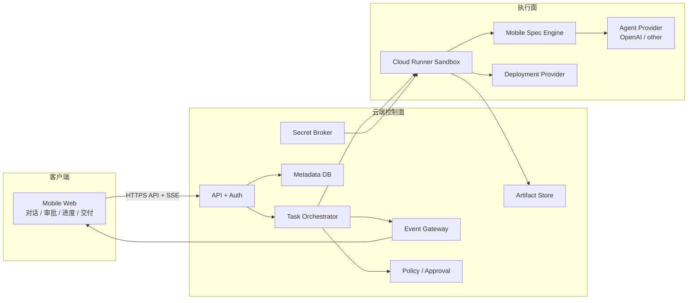
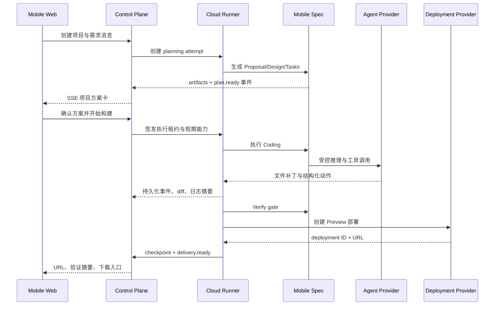

# 总体技术方案

## 1. 架构原则

- 控制面和执行面分离：网站负责任务状态和授权，执行器负责文件与命令。
- 本机和云端实现同一协议，不在 UI 或 Mobile Spec 中写两套流程。
- 手机端不能直接下发任意 Shell；所有动作必须是可校验的结构化指令。
- Mobile Spec 是规格和交付治理层，AI Provider 是可替换推理层。
- 项目、执行尝试、checkpoint 和部署相互独立，失败不覆盖有效基线。
- 长期凭证留在 Secret Broker 或本机凭证代理，模型只接触短期引用。

## 2. 目标架构



## 3. 分层职责

### Mobile Web

- 登录、项目和会话导航。
- 对话输入、方案卡确认和审批。
- 通过 SSE 接收阶段、日志摘要、文件 diff、验证和部署事件。
- 通过 HTTPS 发送开始、暂停、取消、重试和审批结果。
- 不保存执行器令牌、部署密钥或项目完整源码。

### 云端控制面

- `Auth Service`：用户、Session、设备身份和撤销。
- `Conversation Service`：消息、需求来源和 PlanApproval。
- `Task Orchestrator`：任务状态机、执行器选择、租约、超时、重试和恢复。
- `Event Gateway`：事件追加、游标、SSE 推送和断线补发。
- `Policy Service`：结构化动作风险分级、审批和目录/网络策略。
- `Artifact Service`：checkpoint manifest、源码归档、验证证据和短期下载 URL。
- `Secret Broker`：保存第三方授权并签发任务级短期 Secret 引用。

### Desktop Agent（已移除，暂未纳入当前范围）

原计划的本机常驻执行器，负责出站长连接、本机工作区、工具链能力上报与本地凭证代理。当前仓库已移除该组件，真实执行统一走 Cloud Runner。下列职责留作未来重新引入时的设计参考：

- 使用出站 TLS 长连接连接协调服务，不要求电脑开放公网端口。
- 上报 OS、Node、Git、浏览器和移动工具链能力与心跳。
- 将项目绑定到用户明确选择的工作区。
- 在本机策略校验后执行结构化动作，跟踪子进程并流式回传事件。
- 凭证默认留在本机；敏感动作仍由用户单独确认。

### Cloud Runner

- 为一次 `ExecutionAttempt` 创建隔离、限时、限资源的工作区。
- 从模板或 checkpoint 恢复源代码，运行 Mobile Spec 和 Agent Provider。
- 默认拒绝特权容器、宿主机挂载和无限网络出口。
- 完成后上传 checkpoint 和证据，再销毁临时计算环境。

### Mobile Spec Engine

- 维护 Proposal、Specs、Design、Review、Tasks、Coding、Verify、Archive 生命周期。
- 把一句话需求转换为 artifacts、gate 和结构化工具计划。
- 保存需求来源、决策、验证证据和恢复状态。
- 不直接管理平台用户、设备会话或长期第三方凭证。

## 4. 通信方案

| 链路 | 首选协议 | 原因 |
|---|---|---|
| 手机 → 控制面命令 | HTTPS JSON | 简单、可重试、便于鉴权和幂等 |
| 控制面 → 手机事件 | SSE | 手机主要单向接收；支持事件 ID 和自动重连 |
| Cloud Runner ↔ 控制面 | HTTPS/gRPC 内网 | 短期执行器，便于身份和流量治理 |
| Artifact 上传下载 | 对象存储签名 URL | 大文件不经过主 API，权限和过期时间可控 |

事件必须先持久化再推送。SSE 断线后客户端以 `Last-Event-ID` 恢复，不能依赖浏览器一直在线。

## 5. 关键时序

### 新项目云端构建



### 本机模式（已移除，暂未纳入当前范围）

原计划本机模式复用同一时序，仅把 Cloud Runner 替换为 Desktop Agent，由控制面下发 `ExecutionLease + ActionEnvelope`，Agent 再次校验用户、项目、工作区、动作类型和审批票据。Desktop Agent 已移除，当前只保留云端执行路径。

## 6. 执行器选择

`auto` 模式按以下优先级决策：

1. 已有项目是否仅存在于本机。
2. 目标平台和工具链是否只有某台设备具备。
3. 用户是否允许代码上传云端。
4. 云端环境的配额、成本和区域是否满足策略。

一次 attempt 固定一个执行器。切换执行器必须从不可变 checkpoint 创建新 attempt，不能让两个环境同时写一份工作区。

## 7. Agent Provider 方案

核心只依赖 `AgentProvider`：

- `createRun(context, policy)`：创建一次模型运行。
- `continueRun(runId, toolResults)`：提交结构化工具结果。
- `stream(runId)`：接收模型输出和工具请求。
- `cancel(runId)`：取消推理。
- `usage(runId)`：获取 token、耗时和成本元数据。

OpenAI 实现建议使用 Responses API 承载多轮推理和工具调用；长任务可以使用后台执行或 Webhook，但必须由平台自己的任务状态机负责幂等、审批和恢复。模型名、推理强度、存储策略和预算都放在 Provider 配置中，不写死到 Mobile Spec。

官方参考：[OpenAI Responses 与模型指导](https://developers.openai.com/api/docs/guides/latest-model)。

## 8. 当前 MVP 到目标架构的映射

| 当前实现 | 目标替换 |
|---|---|
| Next.js 页面和 Route Handlers | 保留为 Mobile Web 与初期 BFF |
| D1 users/sessions/projects | 扩展为完整控制面元数据模型 |
| 原始需求草稿 | 升级为 Planning Attempt + Mobile Spec 输出 |
| 尚未接入的构建事件区域 | 接入 Event Gateway 的持久化真实事件 |
| 尚未接入的文件/日志区域 | 接入 executor 产生的 diff、日志和证据 |
| 不提供站内预览 | 使用 DeploymentProvider 返回的外部 URL |
| executor 下拉选择 | 连接 capability registry 和路由策略 |

## 9. 建议代码边界

```text
apps/
├── web/                   # 手机 Web + 初期 BFF
├── coordinator/           # 任务、事件、审批、Provider 编排
└── cloud-runner/          # 云端一次性 Runner
packages/
├── mobile-spec/           # 通用规格工作流
├── executor-core/         # 工作区、结构化动作、日志与 checkpoint
├── policy/                # 风险分类和授权票据验证
└── providers/             # Agent / Deploy / Data / Artifact 适配器
```

> 原计划的 `apps/desktop-agent`（本机执行器）和 `packages/protocol`（独立协议代码包）已从当前仓库移除：协议契约直接记录在 [API 与事件协议](API与事件协议.md)，本机执行暂未纳入范围。

控制面可先与 Web 合并部署以降低 MVP 运维成本，但 `executor-core` 和 Provider 接口必须从第一天独立，避免后续拆分时重写协议。
