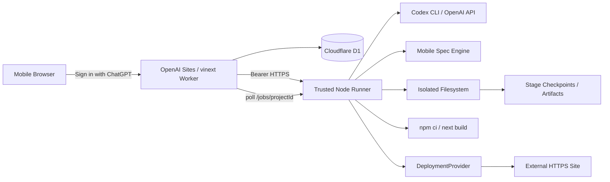
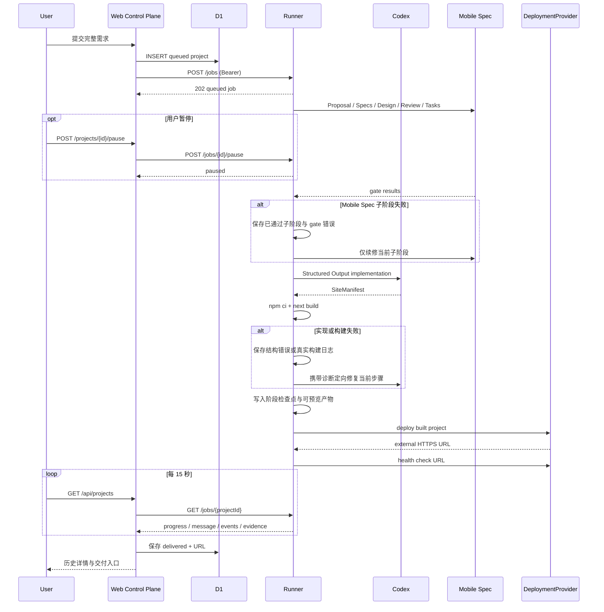

# 总体技术方案

## 1. 当前架构



控制面与执行面严格分离：

- `apps/web` 是 ChatGPT 身份映射、项目、派发、可信状态同步和展示层。
- `packages/codegen` 是文件、模型、Mobile Spec、构建和部署执行层。
- Worker 不执行 Shell，不接触本机文件系统，不把 Runner token 发给浏览器。

## 2. 当前时序



## 3. 可信边界

- 浏览器必须完成 Sign in with ChatGPT；服务端从调度层身份头派生稳定用户主键，所有项目操作只授权当前用户。登录身份不提供执行能力，Codex、Runner、构建与部署均使用平台统一配置。
- 控制站到 Runner 使用独立 Bearer token。
- Runner 生成内容前必须通过 Mobile Spec。
- `SiteManifest` 使用 Zod/JSON Schema 校验，文件路径禁止穿越。
- 构建产物必须真实执行 `npm ci` 与 `next build`。
- 继续执行只能复用需求哈希一致且对应产物完整的成功检查点；失败步骤必须沿用同一需求的子阶段或错误状态原地续修；只有重跑清除旧检查点。
- URL 必须为外部 HTTPS，且不是 localhost、控制站自身或 `/preview`。
- delivered 必须同时具备 Mobile Spec、build、deploy 三项 evidence。

## 4. Provider

### Agent Provider

当前两种结构化生成实现：

1. `CODEX_BIN`：使用本机已登录 Codex CLI，`--ephemeral --sandbox read-only --output-schema`。
2. `OPENAI_API_KEY`：使用 OpenAI Structured Outputs。

二者共享同一 Zod schema 和业务 prompt，不改变 Mobile Spec 与交付门禁。

### Deployment Provider

当前验收 Provider 为 Cloudflare Quick Tunnel：它把构建后启动的 Next.js 进程暴露为临时 HTTPS URL。该 Provider 无持久性和 SLA。

生产 Provider 应满足：持久 deployment ID、幂等查询、域名生命周期、日志、回滚、健康检查和可撤销凭证。Vercel、Cloudflare Pages、OpenAI Sites 或用户自有环境都可作为实现，当前未选定正式默认值。

## 5. 状态一致性

当前 D1 是项目终态来源，Runner 内存是执行中状态来源：

- D1 保存 requirement、status、currentStage、previewUrl。
- D1 的 `runner_endpoints` 保存最近一次通过服务端身份与健康检查的 Runner 地址和实例编号；该地址优先于环境变量回退地址。
- Runner 内存保存 job、progress、message、events、error、evidence；Runner 工作区保存需求哈希检查点和阶段产物。
- `GET /api/projects` 为 building/ready 项目拉取 Runner，并在可信终态时更新 D1。
- 暂停由控制面鉴权后转发给 Runner；Runner 使用 job 专属 `AbortController` 终止当前子进程并回写 `paused`。继续、重跑或单步均分配新 job id，旧 job 事件按 id 隔离。
- `continue` 从首个未完成阶段的保存位置继续，`rerun` 清理全部检查点，`step` 对成功目标直接复用、对失败目标原地续修并在成功后写 `ready`。完整部署检查点复用时保持原 URL。
- Mobile Spec 进度 marker 保存 propose/design/task 的成功前缀与最近 gate 错误；实现/构建 repair marker 保存最近结构、写入或构建诊断。新 manifest 的文件账本用于删除修复后不再需要的旧路由文件。
- Runner 可为自身控制 API 维护 Quick Tunnel；除监测子进程外，还会周期性从公网检查 `/health`。域名返回 1016、5xx 或持续不可达时自动重建，新地址经控制面复核实例身份与部署能力后写入 D1。用户点击“修复连接”的本机握手保留为人工兜底，并在成功后重派原任务。

限制：Runner 重启会丢失执行中状态，但可从本地成功检查点继续。下一阶段应把 job/attempt/event 与产物元数据写入独立控制面，并给 Runner 使用 lease 和共享对象存储。

## 6. 目标生产架构

```text
Sites/Web
  -> durable control-plane API
       -> jobs / attempts / events / checkpoints / artifacts / deployments
  -> managed isolated Cloud Runner pool
       -> AgentProvider
       -> MobileSpecProvider
       -> BuildProvider
       -> DeploymentProvider
  -> object storage + relational metadata + audit
```

目标不改变当前用户语义，只替换临时 Runner、内存事件和 Quick Tunnel。

## 7. 已移除范围

Desktop Agent、本机目录授权、设备配对和独立 `packages/protocol` 当前均不在仓库。未来若重新引入，必须复用同一 job/evidence 协议，不在 UI 或 Mobile Spec 复制第二套流程。
