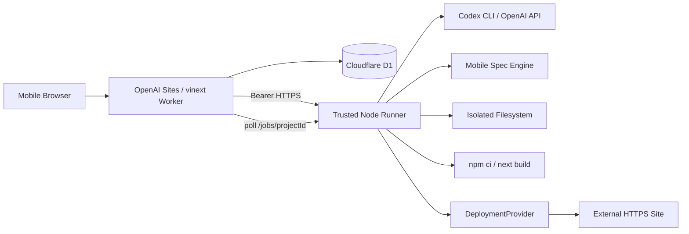
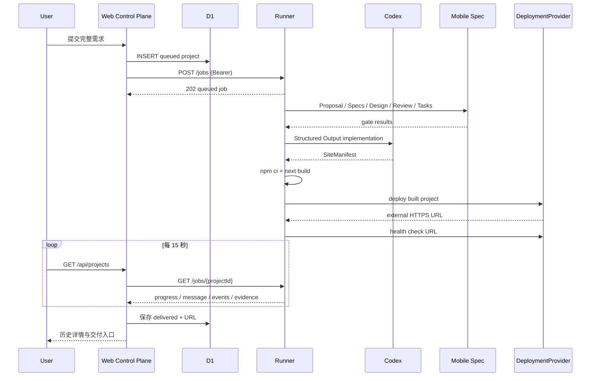

# 总体技术方案

## 1. 当前架构



控制面与执行面严格分离：

- `apps/web` 是会话、项目、派发、可信状态同步和展示层。
- `packages/codegen` 是文件、模型、Mobile Spec、构建和部署执行层。
- Worker 不执行 Shell，不接触本机文件系统，不把 Runner token 发给浏览器。

## 2. 当前时序



## 3. 可信边界

- 浏览器会话只授权用户自己的项目。
- 控制站到 Runner 使用独立 Bearer token。
- Runner 生成内容前必须通过 Mobile Spec。
- `SiteManifest` 使用 Zod/JSON Schema 校验，文件路径禁止穿越。
- 构建产物必须真实执行 `npm ci` 与 `next build`。
- URL 必须为外部 HTTPS，且不是 localhost、控制站自身或 `/preview`。
- delivered 必须同时具备 Mobile Spec、build、deploy 三项 evidence。

## 4. Provider

### Agent Provider

当前两种结构化生成实现：

1. `CODEX_BIN`：使用本机已登录 Codex CLI，`--ephemeral --sandbox read-only --output-schema`。
2. `OPENAI_API_KEY`：使用 OpenAI Structured Outputs。

二者共享同一 Zod schema 和业务 prompt，不改变 Mobile Spec 与交付门禁。

### Deployment Provider

当前验收 Provider 为 Cloudflare Quick Tunnel：它把构建后启动的 Next.js 进程暴露为临时 HTTPS URL。该 Provider 无持久性和 SLA。

生产 Provider 应满足：持久 deployment ID、幂等查询、域名生命周期、日志、回滚、健康检查和可撤销凭证。Vercel、Cloudflare Pages、OpenAI Sites 或用户自有环境都可作为实现，当前未选定正式默认值。

## 5. 状态一致性

当前 D1 是项目终态来源，Runner 内存是执行中状态来源：

- D1 保存 requirement、status、currentStage、previewUrl。
- Runner 保存 job、progress、message、events、error、evidence。
- `GET /api/projects` 为 building 项目拉取 Runner，并在可信终态时更新 D1。

限制：Runner 重启会丢失执行中状态。下一阶段应把 job/attempt/event 写入 D1 或独立控制面，并给 Runner 使用 lease 与 checkpoint。

## 6. 目标生产架构

```text
Sites/Web
  -> durable control-plane API
       -> jobs / attempts / events / checkpoints / artifacts / deployments
  -> managed isolated Cloud Runner pool
       -> AgentProvider
       -> MobileSpecProvider
       -> BuildProvider
       -> DeploymentProvider
  -> object storage + relational metadata + audit
```

目标不改变当前用户语义，只替换临时 Runner、内存事件和 Quick Tunnel。

## 7. 已移除范围

Desktop Agent、本机目录授权、设备配对和独立 `packages/protocol` 当前均不在仓库。未来若重新引入，必须复用同一 job/evidence 协议，不在 UI 或 Mobile Spec 复制第二套流程。
