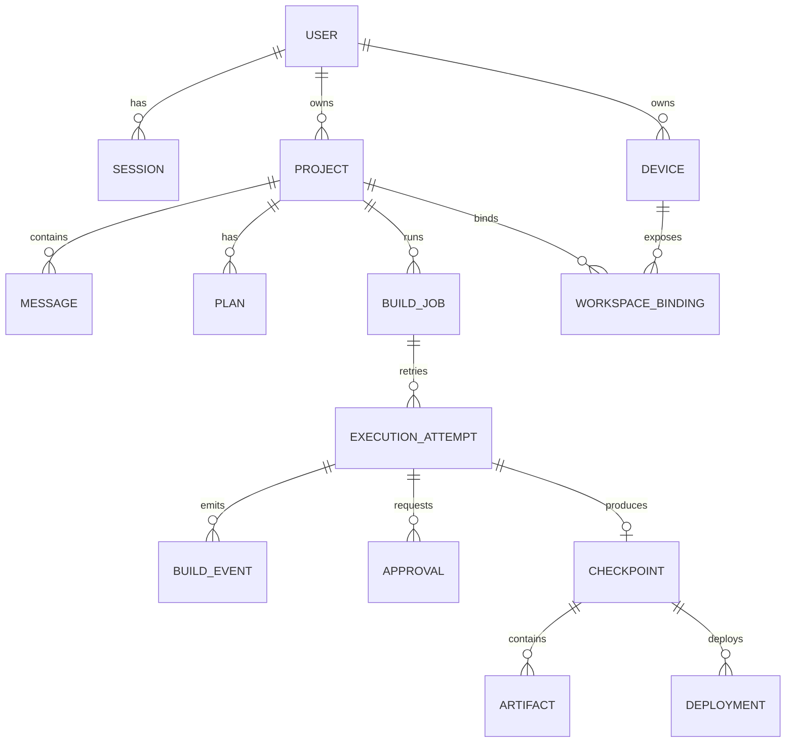

# 数据模型

## 1. 建模原则

- 对话、项目和执行分开：聊天消息不能承担源码版本管理。
- `Project` 是长期实体，`BuildJob` 是一次用户目标，`ExecutionAttempt` 是一次实际运行。
- checkpoint 不可变，最新版本通过指针推进而不是覆盖历史。
- 事件采用追加写，支持断线重放和完整审计。
- 本机绝对路径、Secret 明文和模型隐藏推理不进入云端业务表。

## 2. 核心关系



## 3. 实体定义

### User / Session

- `User`：`id`、`username`、`status`、`createdAt`。
- `Credential`：Provider、密码哈希或外部身份引用、轮换信息。
- `Session`：token 哈希、到期时间、最近使用时间、撤销时间和客户端元数据。

密码和 Session token 只存哈希。未来增加 SSO 时不改变 User 主键。

### Device / WorkspaceBinding

- `Device`：设备名、平台、Agent 版本、状态、最后心跳和能力摘要。
- `DeviceCredential`：可撤销设备令牌哈希、签发和过期时间。
- `WorkspaceBinding`：项目、设备、工作区不透明引用、权限范围和最近指纹。

控制面只保存 `workspaceRef`；本机绝对路径解析依赖未来的 Desktop Agent，当前未纳入范围。

### Project / Message / Plan

- `Project`：所有者、名称、默认执行模式、最新 checkpoint、最新部署和生命周期状态。
- `Message`：角色、文本、附件引用、需求来源和创建时间。
- `Plan`：版本、方案摘要、Mobile Spec change、状态和待回答问题。
- `PlanApproval`：确认的 plan 版本、用户和时间；修改计划后旧批准自动失效。

### BuildJob / ExecutionAttempt

- `BuildJob`：项目、目标 plan、交付目标、状态和当前 attempt。
- `ExecutionAttempt`：执行器类型、执行器 ID、base/result checkpoint、租约、限制、失败分类和时间。
- `ExecutionLease`：持有者、过期时间和 fencing token，防止旧执行器恢复后继续写入。

### BuildEvent

- `id`、`attemptId`、`sequence`、`type`、`actor`、`visibility`、`payload`、`occurredAt`。
- 对 `(attemptId, sequence)` 和 `id` 建唯一索引。
- 大日志块保存到 Artifact Store，事件只保存摘要和引用。

### Checkpoint / Artifact

- `Checkpoint`：父 checkpoint、内容摘要、manifest 引用、生成 attempt 和验证状态。
- `Artifact`：类型、存储引用、媒体类型、大小、摘要、保留策略和脱敏状态。
- 推荐 artifact 类型：`source-archive`、`mobile-spec`、`build-output`、`test-report`、`log-chunk`、`diff`、`delivery-manifest`。

### Approval / SecretGrant

- `Approval`：动作摘要、风险、影响范围、状态、到期时间和决定人。
- `SecretGrant`：Secret 不透明引用、允许的 Provider/动作、attempt、到期时间和使用次数。
- 业务库不保存第三方明文 Secret；它只保存 Secret Broker 的引用。

### Deployment

- `Deployment`：Provider、环境、外部 deployment ID、checkpoint、状态、URL、健康检查、创建和完成时间。
- 同一 checkpoint 可有多个部署；Production 必须使用独立审批和环境策略。

## 4. 状态机

### BuildJob

```text
draft
  -> planning
  -> awaiting_approval
  -> queued
  -> running
  -> verifying
  -> deploying
  -> ready
```

任意活动状态可以进入 `blocked`、`failed` 或 `cancelled`；重试创建新 attempt，不把原 attempt 改回 running。

### ExecutionAttempt

`created → leased → preparing → executing → verifying → collecting → succeeded`

终止状态为 `failed`、`cancelled`、`expired`。只有一个持有有效 fencing token 的执行器可以追加可改变项目基线的事件。

## 5. MVP 数据库演进

当前 D1 已有 `users`、`sessions`、`projects`。建议按以下顺序演进：

1. 增加 `messages`、`plans`、`plan_approvals`。
2. 增加 `build_jobs`、`execution_attempts`、`build_events`。
3. 增加 `checkpoints`、`artifacts`、`deployments`。
4. （Desktop Agent 相关，当前未纳入范围）增加 `devices`、`device_credentials`、`workspace_bindings`。
5. 外部凭证接入前增加 `secret_refs`、`approvals`、`secret_grants`。

所有 migration 必须向前兼容上一线上版本；破坏性字段删除采用“新增 → 双写 → 回填 → 切读 → 删除”的多阶段流程。

## 6. 索引和保留建议

- 项目列表：`(owner_user_id, updated_at DESC)`。
- 任务列表：`(project_id, created_at DESC)`。
- 事件恢复：唯一 `(attempt_id, sequence)`。
- 活跃租约：`(executor_id, lease_expires_at)`。
- 待审批：`(owner_user_id, status, expires_at)`。

业务元数据和审计事件的保留期由产品与合规策略配置。源码归档、日志和构建物分开设定生命周期；删除项目时先进入可恢复回收期，再异步清理对象存储和派生部署。
