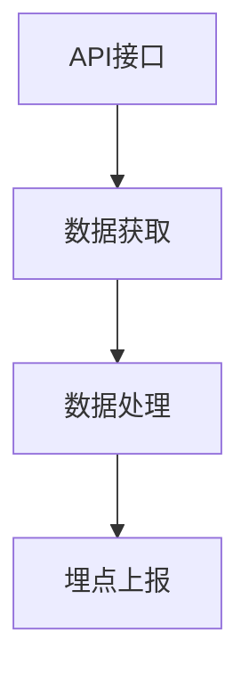

# 埋点改动文档模板

> 此文档由 tracking-dev skill 自动生成，用于记录埋点实现细节和字段映射关系

## 项目信息

- **生成时间**: {timestamp}
- **相关文件**: {files}
- **接口文档**: {api_docs}

---

## 埋点列表

### 1. {埋点中文名称}

#### 基本信息

| 字段 | 值 |
|------|-----|
| **埋点名称** | {name} |
| **Event ID** | `{event_id}` |
| **上报时机** | {trigger_timing} |
| **应用页面** | {page_name} |
| **埋点类型** | {type: 曝光/点击/其他} |

#### 参数列表

| 参数名 | 类型 | 必填 | 说明 | 来源 | 映射路径 |
|--------|------|------|------|------|----------|
| {param_key} | {type} | {required} | {description} | {source} | {mapping_path} |

#### 上报时机实现

**PRD 描述**: {prd_description}

**实现方式**:
- [ ] 页面/组件加载（onMounted）
- [ ] 按钮点击（@click）
- [ ] 元素曝光（IntersectionObserver）
- [ ] 路由变化（watch route）
- [ ] Props 变化（watch props）
- [ ] API 返回后（.then）
- [ ] 其他：{custom_implementation}

**代码位置**: {file_path}:{line_number}

```typescript
// 代码示例
{code_snippet}
```

#### 接口字段映射

**依赖接口**: `{api_endpoint}`

**字段映射关系**:

| 埋点参数 | 接口字段 | 字段路径 | 默认值 | 备注 |
|----------|----------|----------|--------|------|
| {param} | {api_field} | {path} | {default} | {note} |

**数据流**:
```
API Response
  └─ data
      ├─ field1 → 埋点参数 param1
      └─ items[0].status → 埋点参数 param2
```

#### 验证要点

- [ ] 参数值是否正确获取
- [ ] 上报时机是否准确
- [ ] 空值/异常情况处理
- [ ] 埋点是否重复上报

---

### 2. {下一个埋点}

...

---

## 变更影响范围

### 修改文件列表

1. `{file_path}` - {change_description}
2. ...

### 依赖关系



### 风险点

- {risk_point_1}
- {risk_point_2}

---

## 审核确认

### 开发者自查

- [ ] 所有埋点已按照 PRD 实现
- [ ] 参数映射关系已验证
- [ ] 代码符合项目规范
- [ ] 无 TypeScript 类型错误

### 需要确认的问题

1. {question_1}
2. {question_2}

### 审核记录

| 日期 | 审核人 | 结果 | 备注 |
|------|--------|------|------|
| | | | |

---

## 附录

### 相关接口文档

- [接口1]({api_doc_url})
- [接口2]({api_doc_url})

### 测试验证

**验证步骤**:
1. {test_step_1}
2. {test_step_2}

**预期结果**:
- {expected_result}

**实际结果**:
- {actual_result}
