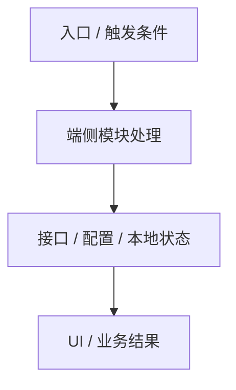

# Native技术方案

> **目标**：在 Proposal 与 Specs 的需求边界内，说明本次 change 如何在端侧落地。
> **权威输入**：Proposal 与 Specs 定义需求边界和行为；PRD / 用户或 PM 明确确认定义静态内容，真实接口返回 / 联调数据定义动态内容；后端方案、接口文档、代码和项目上下文确认实现事实；设计稿只定义样式。
> **内容边界**：Design 可以定义接口、模块、状态、生命周期和技术选型，但不得静默新增或改写需求。设计稿示例与权威内容来源不一致时，由 Agent 按上述优先级直接决断，不作为未决问题；只有权威来源本身缺失或冲突时才写入「八、未决问题」并标注来源、影响与 Owner。
> **元信息**
> - 方案负责人：
> - 评审状态：草案 / 评审中 / 通过 / 阻塞
> - 评审日期：
> - 阻塞项：<!-- 列出当前未关闭的阻塞，无则写"无" -->

---

## 一、概览

### 1.1 来源链接

<!-- 用于后续 review 追溯需求来源；不适用写“不涉及”，适用但无链接时写“待补充”，并同步进入「八、未决问题」。 -->

| 类型 | 链接 / 标识 | 用途 |
|------|-------------|------|
| 补充链接 |  | 需求来源与评审追溯 |
| PRD 文档 |  | 需求范围与验收标准 |
| 视觉稿 |  | UI 与设计还原证据 |
| API 接口文档 |  | 接口契约与异常处理 |
| 真实接口数据 |  | 动态字段、状态、枚举和展示值 |

### 1.2 背景

<!-- 阐述：1. 为什么要做这个需求；2. 需求的预期收益；3. 明确需求指标。 -->

### 1.3 需求改动点

<!-- 快速说明本次需求范围。不涉及的项目填写“否”，改动描述填写“不涉及”，不得留空。 -->
<!-- 需求改动点来源限于 Specs，并且不得超出 Proposal 的“做什么 / 不做什么”边界；改动项需精简提炼。 -->

| 改动项 | 改动描述 |
|--------|----------|


---

## 二、整体方案

<!-- 本章必须包含完整方案，而不是只写摘要。
     读者只看本章时，应能理解本次端侧如何落地：改哪些模块、读哪些上下文、核心流程如何走、
     状态如何流转、接口/配置/埋点如何接入、如何兼容降级、如何验证。
     后续章节用于补充表格和细节，不得把关键设计点只散落在后续章节。-->

### 2.1 上下文读取清单

<!-- 列出生成本方案前已读取或必须读取的上下文。Android 可包括主工程 AGENTS、模块 AGENTS、
     docs/biz/features、architecture、glossary；iOS 可包括主工程 AGENTS、业务线 Index、组件 docs。
     未读取但需要人工补齐的上下文必须写入「八、未决问题」。 -->

| 类型 | 路径 / 文档 | 读取状态 | 结论 / 约束 |
|------|-------------|----------|-------------|
| 主工程规则 | `AGENTS.md` / `CLAUDE.md` | 已读 / 待读 / 不涉及 |  |
| 业务上下文 |  | 已读 / 待读 / 不涉及 |  |
| 模块 / 组件上下文 |  | 已读 / 待读 / 不涉及 |  |

### 2.2 修改边界

| 类型 | 路径 / 模块 / 组件 | 说明 |
|------|-------------------|------|
| 预计修改 |  |  |
| 只读参考 |  |  |
| 禁止修改 |  |  |

### 2.3 现有能力复用评估

<!-- 开始新增实现前，先确认项目中是否已有可复用的页面、组件、服务、接口封装、状态管理、
     路由、配置、埋点或降级能力。不涉及复用时填写“不涉及”并说明原因，不得留空。 -->

| 现有能力 | 所在模块 / 定位入口 | 复用方式 | 需要适配的内容 | 不能复用的边界 / 原因 |
|----------|--------------------|----------|----------------|----------------------|
|  |  | 直接复用 / 扩展复用 / 不复用 |  |  |

### 2.4 流程图 / 时序图（涉及判断分直流程均需要画流程图或者时序图）



### 2.5 端侧完整方案

<!-- 用一段结构化描述和必要图示说明：
     1. 入口与触发条件；
     2. 模块 / 组件分工；
     3. 数据和状态流转；
     4. 接口、配置、实验、埋点如何协作；
     5. 兼容、降级和异常路径；
     6. 复用哪些现有能力、新增哪些实现，以及两者的职责边界；
     7. 为什么选择该方案，以及放弃了哪些替代方案。 -->

---

## 三、接口文档（api侧接口）

<!-- 摘要表：每个接口必须在下方「3.X 接口详情」中有同名子节，并就地详写入参、返回数据、异常处理和降级。
     「确认状态」未对齐前不要勾 ✅，⏳/⚠️ 状态须在「八、未决问题」中追踪。 -->

| 接口名 | METHOD + Path | 来源 | 确认状态 | 关联页面 / 规则域 |
|--------|---------------|------|---------|-----------------|
| <接口名> | `GET /api/...` | 后端技术方案（<链接>）/ 客户端自定义 | ✅ 已对齐 / ⏳ 待对齐 / ⚠️ 阻塞 | <page-spec-id-or-shared-spec-id> |

### 3.1 <接口名>

#### 3.1.1 接口请求时机

<!-- 什么 UI 行为或业务流程会触发这个接口。 -->

#### 3.1.2 入参

| 参数名 | 参数类型 | 是否必传 | 含义 | 示例 | 备注 |
|---------|-------|------|------|------|------|
|  |  |  |  |  | |

#### 3.1.3 返回数据

```json

```

#### 3.1.4 接口 Mock 数据

<!-- Mock 文件路径或 Mock 平台链接。 -->

---

## 四、影响面

优先列举履约相关，示例如下：
| 维度 | 是否涉及 | 说明 |
| --- | --- | --- |
| Pod / 模块 | 是 / 否 |
| 页面 / 路由 | 是 / 否 |
| 状态机 | 是 / 否 |  |
| 请求接口 | 是 / 否 |  |
| 开关配置 | 是 / 否 |  |
| 通知事件 | 是 / 否 |  |
| 动态指令 | 是 / 否 |  |
| 订单缓存变更 | 是 / 否 |
| 听单过滤 | 是 / 否 |  |

## 五、实验 & 埋点

### 5.1 实验（AB）

> 明确是否需要做 AB 实验，如何分组，以什么维度开城。

- 是否需要 AB 实验：是 / 否
- 分组策略：
- 开城维度：

### 5.2 埋点

> 明确埋点的上报时机、上报次数，如已有存量埋点尽量复用。

| 事件 / 日志 | 触发时机 | 上报次数 | 字段 | 是否复用存量 |
|------------|---------|---------|------|------------|
|  |  |  |  |  |


## 六、风险及监控

### 6.1 风险点

> 详细评估本次改动风险点，涉及的风险点打 ✅，不涉及的加删除线。务必周知相关方。

- [ ] 影响正常流程流转
- [ ] 涉及历史版本缓存数据的读取、覆盖、删除等操作
- [ ] 存在高风险行为（kill 进程 / throw 异常 / 阻断弹窗等）
- [ ] 放量由 Apollo 或 API 控制，灰度期间不一定放量（是否允许灰度期间不放量？）
- [ ] API 存在版本控制逻辑
- [ ] <其他风险>

### 6.2 监控方案

> 须有健全的监控方案，监控本次上线造成的影响。

- **核心流程大盘监控**：
- **客户端稳定性监控**（crash / 卡顿 / OOM）：
- **后端稳定性监控**（QPS / 业务指标）：
- **业务指标监控**（埋点数量级是否正常等）：

### 6.3 降级方案

> 详细给出本次改动上线后的降级方案。

- [ ] API 控制
- [ ] Apollo 控制
- [ ] 降级包（考虑以下场景）：
  - 全新安装是否有问题
  - 用户清除数据后覆盖安装是否有问题
  - 用户覆盖线上最新版本安装是否有问题

## 七、测试策略

<!-- 手工场景验证由 verify 阶段按 specs scenario 兜底,这里只列自动化层面的测试策略。 -->

- 集成 / 交互测试：
- 视觉 / UI：


## 八、未决问题

<!-- 接口契约表中 ⏳/⚠️ 状态的接口必须出现在这里。设计稿示例差异不属于未决问题。 -->

- [ ] <问题> - Owner：<姓名>

## 九、评审就绪 Checklist

- [ ] Proposal 阻塞已解决或已记录例外
- [ ] specs/ 已产出对应页面 / shared Spec 文件
- [ ] 上下文读取清单已列明且待读项均进入未决问题
- [ ] 整体方案已覆盖模块边界、入口链路、状态流转、接口 / 配置 / 埋点、兼容降级和验证策略
- [ ] 预计修改文件、只读参考文件、禁止修改范围已明确
- [ ] 接口契约摘要表所有接口已在「3.X 接口详情」中详写
- [ ] ✅ 状态接口已确认：字段、异常处理、降级、Mock
- [ ] 各接口异常处理已覆盖空响应、超时、关键错误码
- [ ] 埋点和实验完整
- [ ] 风险点已评估并周知相关方
- [ ] 降级方案完整
- [ ] 未决问题均已分配 Owner

<!--
Agent 自检（不在 Design 渲染结果中展示）：
- [ ] Specs 中每条 Requirement 至少被一个实现改动引用
- [ ] 每个实现改动都包含代码落点、实现说明和验证重点
- [ ] 产品范围沿用 Proposal 术语，且未被误用为技术组件拆分依据
- [ ] 实际涉及的接口、状态、UI、埋点、兼容和发布事项已就近说明
- [ ] 跨模块设计只在满足触发条件时保留
- [ ] Design 未重复需求正文、未新增需求、未保留读取状态或评审状态
- [ ] 设计稿只用于样式；静态 / 动态内容分别以 PRD / 明确确认和真实接口返回 / 联调数据为准
- [ ] 权威来源缺失、冲突和阻塞项已写入风险与待确认并分配 Owner
- [ ] 验证方案覆盖本次实现改动的主要风险
-->
